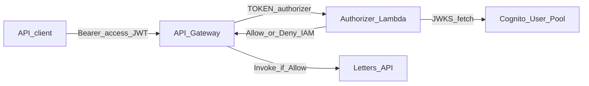

# Architecture

> **AI agents — read this file when:** changing handler structure, packaging, CloudFormation, or auth data flow.

---

## System overview

1. API Gateway receives a request with `Authorization: Bearer <access_token>`.
2. The TOKEN authorizer Lambda (`src/index.ts`) verifies the JWT against Cognito JWKS (`jose`).
3. On success it returns an IAM policy allowing `execute-api:Invoke` on `event.methodArn`, plus context (`username`, `scope`).
4. On failure it throws `Unauthorized` (API Gateway deny).

---

## Folder responsibilities

| Path                 | Responsibility                                              |
| -------------------- | ----------------------------------------------------------- |
| `src/index.ts`       | Authorizer handler                                          |
| `src/index.test.ts`  | Unit tests (mock `jose`)                                    |
| `scripts/`           | Local Cognito token + bastion helpers; `preflight.sh`       |
| `webpack.config.js`  | Bundle to `dist/index.js`; inject Cognito env at build time |
| `template.yaml`      | Function, version, API Gateway invoke permission            |
| `cloudformation/`    | Supporting S3 artifact bucket + execution role stacks       |
| `docs/`              | Governance                                                  |
| `.github/workflows/` | PR checks; merge → dev deploy; manual deploy/rollback       |

---

## Dependency direction

- Handler may depend on `jose` and AWS Lambda types only.
- Scripts may use AWS SDK Cognito client + `dotenv` for local tooling — not bundled into the Lambda zip unless intentionally added.
- Do not introduce a multi-package monorepo without approval.

---

## Deploy topology

- Build: `npm run build` → `dist/index.js`
- Package: `npm run package` → `dist/authorizer.zip`
- Upload: `s3://100-letters-project-authorizer-{env}/authorizer/{artifact}.zip`
- Update stack: CloudFormation `one-hundred-letters-authorizer-stack-{env}` with `S3Key` + `Environment`

Runtime: **Node 20**, handler **`index.handler`**, region **us-west-2**.
